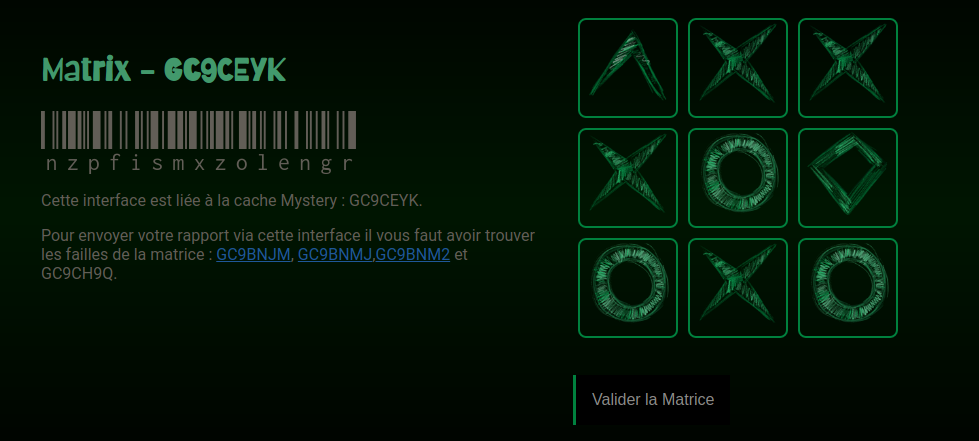

# Géocaching : cache bonus Matrice (back)

## Il était une fois... 

Je suis passionnée par les énigmes et les jeux en tout genre : il était donc évident que je me passionne pour le géocaching et que je pose aussi des caches. Si vous ne connaissez pas le concept, n'hésitez pas à faire un tour ici sur le [site officiel](https://www.geocaching.com/play).

L'une des caches que j'ai cachées à Bordeaux nécessite de résoudre une énigme dont la réponse est à fournir sur ce site que j'ai développé. Vous pouvez consulter la fiche de cette cache sur [geocaching.com](https://www.geocaching.com/geocache/GC9CEYK)

## Concrètement, que fait ce jeu ? 

Le back de cette application ne fait que vérifier l'exactitude de la réponse fournie par le joueur depuis le front. 

La bonne réponse est stockée dans une variable d'environnement, côté back ce qui permet d'éviter de récupérer la réponse sans jouer véritable le jeu. 

Si la réponse est juste, l'application renvoie au front les coordonnées GPS qui indiquent l'emplacement de la dernière cache à trouver. 

Vous pouvez tester le jeu hébergé sur [herokuapp](https://matrice-gc.herokuapp.com/). J'utilise la version freemium d'Heroku, le temps de chargement peut être très long car Heroku éteint les serveurs en cas de non utilisation du site. Pour valider la (fausse) bonne réponse, remplissez la matrice de "triangles". 

## Screenshot du jeu



## Stack Technique (prérequis)

 


Git : https://git-scm.com/downloads

NodeJS (v12 ou supérieure) : https://nodejs.org/en/download/

## Comment l'utiliser ? 

1. Télécharger le repo sur votre machine

```bash
git clone <url du repo>
```

2. Installez les dépendances

```bash
npm install 
```
4. Adaptez votre fichier `.env` avec les informations du jeu.
9. Exécuter `npm start` pour lancer l'application. 


### variables Env

**A décrire dans votre fichier `.env`**

- `PORT` => le port de votre serveur. Si vous lancez l'application sur votre machine hôte, connectez-vous ensuite à `http://localhost:<PORT>`
- `GPS` => les coordonnées GPS à envoyer au front. Il s'agit d'une string, il n'est donc pas obligatoire de respecter un format particulier.
- `GOOD_ANSWER` => La bonne réponse attendue par le back sous ce format "120140201". Chaque chiffre correspond à une forme de la matrice. 

| Forme    | Chiffre |
| -------- | ------- |
| vide     | 0       |
| triangle | 1       |
| losange  | 2       |
| croix    | 3       |
| cercle   | 4       |


## Détails des routes

| Routes    | Methode | Controllers                    | Action                                                                    |
| --------- | ------- | ------------------------------ | ------------------------------------------------------------------------- |
| `/answer` | POST    | resultController.compareResult | Vérifie la réponse et renvoie des coordonnées GPS si la réponse est juste |

